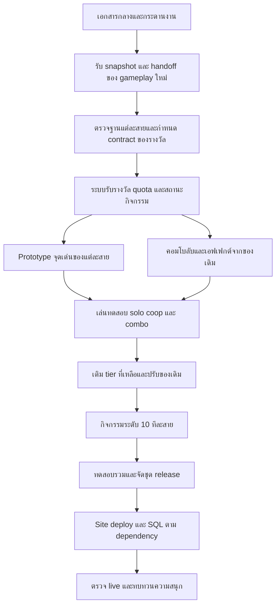

# แผน implement รางวัลสายอาชีพถึงระดับ 10

แผนกลางสำหรับ FC Cash Town ครอบคลุม 9 สายอาชีพ เติมรางวัลที่ขาด 42 ชิ้น ทบทวนรางวัลเดิม 48 ชิ้น และเพิ่มคอมโบลับของเครื่องรางกับสัตว์คู่ใจ เป้าหมายคือให้แต่ละสายมีช่วงที่โดดเด่นและมีเหตุผลให้กลับมาเล่น โดยต่อยอด gameplay ที่อีก session กำลังขยายอยู่ ผู้ใช้ขอเตรียมแผนและตัวกลางสำหรับหลายแชทเมื่อ 2026-10-10; รางวัลใหม่ยังเป็นแผน ส่วนคอมโบชุดนำร่อง 5 ชุด implement/tested ในเครื่องแล้ว ดู combo-implementation.md

## จุดเริ่มต้นของทุก session

อ่านตามลำดับนี้ก่อนรับงานหรือหลัง compact:

1. [ข้อตกลงและลำดับงาน](README.md) กำหนดทิศทาง ขอบเขต และการทำงานร่วมกัน
2. [แบบรางวัลและ balance](rewards.md) ระบุข้อเสนอครบทุก tier ที่ยังขาด
3. [แบบคอมโบลับและเอฟเฟกต์](secret-combos.md) ระบุชุดสวม ผลพิเศษ การค้นพบ และกติกาป้องกันการเฉลยสูตรให้ client
4. [กระดานงาน](work-board.md) ระบุ dependency ผู้รับงาน และสถานะจริง
5. [จุดส่งต่องานล่าสุด](handoff.md) ระบุสิ่งที่เสร็จ สิ่งที่ห้ามถือว่าเสร็จ และขั้นต่อไป
6. [แผนขยาย gameplay](../../../.claude/skills/fc-cash-town/references/adventure-expansion.md) และ source ของสายที่จะทำ ให้ตรวจฉบับล่าสุดทุกครั้ง

เอกสารชุดนี้เป็นจุดอ้างอิงของงานรางวัลถึงระดับ 10 ส่วนแผน adventure-expansion เป็นจุดอ้างอิงของระบบ gameplay ใหม่ เมื่อพบความขัดแย้งให้บันทึกผลกระทบและแก้แบบรางวัลให้เข้ากับระบบจริง อย่าเปลี่ยนข้อกำหนดของอีก session เงียบ ๆ

## ทิศทางที่ต้องรักษา

| เรื่อง | ข้อตกลงสำหรับงานนี้ |
|---|---|
| ความสนุก | ได้เลือก ได้ค้นพบ ได้ลองเก่งขึ้น และมีเรื่องให้เล่าหรือชวนเพื่อนทำ |
| ความต่างของสาย | ไม่ต้องหารายได้หรือประหยัดแรงเท่ากัน ให้เด่นคนละด้านและคนละระดับ |
| ความ OP | ยอมรับของระดับ 9–9.5 เมื่อยังมีการเล่นจริงและขอบเขตชัด คะแนนสูงไม่ใช่คำสั่ง nerf |
| ของเดิม | รักษากวางมอสเดินเร็ว ถุงมือช่วยเพื่อน สวิงเห็นแมลง และเอกลักษณ์เดิมเป็นหลัก |
| ระดับสูง | เปิดทางเลือกหรือกิจกรรมใหม่ ไม่เพิ่มแต่เปอร์เซ็นต์ และไม่ทำให้ของระดับต้นใช้ไม่ได้ |
| การค้นพบ | ผู้เล่นพบเบาะแสจากงานปกติ ซ่อนสูตรและของที่ยังไม่ค้นพบ ไม่ทำ public patch notes สำหรับชุดนี้ |
| ผู้เล่น solo | ต้องทำ progression หลักได้ด้วยตัวเอง ของ social ทำให้ชวนเพื่อนแล้วดีขึ้น |
| การกลับมาเล่น | กิจกรรมยาวพักต่อได้ ไม่บังคับออนไลน์ทุกมื้อ และไม่ทำ streak ที่พลาดวันเดียวเสียของสะสม |
| เศรษฐกิจ | ของเพิ่มต้องมีที่ใช้จริง รักษาค่าทำงาน วัตถุดิบ แรง และเงินที่เกี่ยวข้อง |
| ช่องอุปกรณ์ | เครื่องราง 2 ชิ้น ภูต 1 ตัว เปลี่ยนฟรี; things ต้องประเมินร่วมกันเพราะไม่ใช้ช่อง |
| คอมโบลับ | ชุดสองหรือสามชิ้นที่สวมจริง รวมข้ามสาย; ผู้เล่นพบจากผลและ VFX ไม่แสดงสูตรทั้งหมดล่วงหน้า |

ชื่อไอเทม ตัวเลข และคะแนนใน rewards.md เป็นแบบตั้งต้นสำหรับ prototype ยังไม่ใช่ผลวัดหรือพฤติกรรมที่เปิดใช้จริง ให้ปรับได้เมื่อหลักฐานจาก gameplay ใหม่ชี้ว่าซ้ำ อ่อน หรือทำให้การเล่นหายไป พร้อมบันทึกเหตุผลใน decision log

## สถานะฐานเกม ณ วันที่เริ่มแผน

ตรวจ source ใน working tree วันที่ 2026-10-10 เวลา 14:06 น. Asia/Bangkok ซึ่งมีงานของอีก session อยู่หลายไฟล์ Snapshot นี้ใช้วาง dependency; ก่อน implement ต้องตรวจ source ใหม่

| เรื่อง | ฐานที่พบ | สิ่งที่ต้องยืนยันก่อนใช้ |
|---|---|---|
| รางวัลสายอาชีพ | [gifts.ts](../../../lib/town/gifts.ts) มี 45 ชิ้น และ [well.ts](../../../lib/town/well.ts) มีรางวัลหาบน้ำเดิมอีก 3 ชิ้น | ตรวจ runtime `gives`, การรับ และ server catalog ด้วย |
| Tier ที่ขาด | 7 สายเดิมขาด 7–10; ตัดไม้และเหมืองขาด 4–10 รวม 42 ชิ้น | เป้าหมายรวม 90 รางวัล ไม่ใช่เพิ่ม 90 ชิ้น |
| Workshop และปลา | มี [crafting.ts](../../../lib/town/crafting.ts), [river-fishing.ts](../../../lib/town/river-fishing.ts), [river-items.ts](../../../lib/town/river-items.ts) และ v180–v182 | Code, tests, deploy และ SQL installation เป็นคนละสถานะ |
| ไม้ | มี [wood-grain.ts](../../../lib/town/wood-grain.ts), [woodcutting.ts](../../../lib/town/woodcutting.ts) และ v184 | คุณภาพขึ้นกับรอยบาก ทิศล้ม และความพลาด; ต้องผ่าน baseline gate |
| เหมือง | มี [geology.ts](../../../lib/town/geology.ts), [geology-items.ts](../../../lib/town/geology-items.ts) และ v185 | รางวัลธรณีวิทยาขึ้นกับผลขุดจริง ไม่ใช่ของฟรีจากการขุดพลาด |
| สวน | มี [gardening.ts](../../../lib/town/gardening.ts), [garden-items.ts](../../../lib/town/garden-items.ts) และ v186 | พืชหลายช่องหมุนได้; ผสมพันธุ์เป็นคู่กำหนดแน่นอน และจ่ายผลที่ root ครั้งเดียว |
| แมลง ป่า น้ำ ครัว ผู้ช่วย | อยู่ใน phase ที่ระบุในแผนขยาย gameplay | ต้องรับ handoff ของระบบพื้นฐานก่อนปิดแบบรางวัลที่ใช้ระบบเหล่านั้น |
| Production | แผนขยาย gameplay บันทึก v179 เป็น baseline, v183 ตรวจ live แล้ว และ v180–v182 รอ SQL | ข้อมูลจาก handoff ของอีก session ไม่ใช่การตรวจ live ในงานวางแผนนี้ |

การเพิ่มรางวัลต้องแยกจากเป้าหมาย 25 usable items ต่อสายของ adventure-expansion อย่านับรางวัลเหล่านี้แทนโควตา 225 ชิ้นเอง ต้องตกลงขอบเขตและกติกานับก่อน

## แผนภาพการ implement



กราฟแสดงลำดับหลัก แต่ baseline gate แยกต่อสาย งานตัดไม้เริ่มได้เมื่อฐานไม้ผ่าน แม้ครัวยังทำอยู่ Prototype ต้องส่งครบหนึ่งเส้นทางตั้งแต่รับรางวัลจนเล่นได้ ก่อนกระจายเติมหลายสิบคำประกาศใน catalog

## ลำดับและขนาดงาน

| ช่วง | ผลลัพธ์ที่ต้องได้ | เงื่อนไขออกจากช่วง |
|---|---|---|
| เตรียมฐาน | Snapshot gameplay, แผนเจ้าของไฟล์, contract ของ reward แรก และ test plan | รู้ว่าระบบไหนใช้ได้จริง ระบบไหนกำลังเปลี่ยน |
| Foundation | วิธีรับรางวัลใหม่ capability gate, quota, resume และการจ่ายผลที่เชื่อถือได้ | client กับ server ตรงกัน; server เก่าไม่แสดงของที่ยังใช้ไม่ได้ |
| คอมโบลับ | Matcher ฝั่ง server, shared quota, discovery, VFX และ pilot จากของเดิม | ชุดสวมถูกช่อง ผลเกิดจริง ไม่ส่งสูตรที่ยังไม่พบ และการสลับไม่ทำผลซ้ำ |
| Prototype | จุดเด่นครบทั้ง 9 สาย เริ่มจากไม้ เหมือง สวน ตามความพร้อมของฐาน | ผู้เล่นเข้าใจการใช้และยังต้องเล่นเอง; ของใหม่ไม่แทนเครื่องมือปกติด้วย effect ซ้ำ |
| เติม tier | ครบของใหม่ 42 ชิ้น ปรับของเดิมที่มีหลักฐานว่าอ่อนหรือใช้งานลำบาก | ช่องที่ขาดเป็นศูนย์ และแต่ละชิ้นมี use path จริง |
| ระดับ 10 | กิจกรรมพิเศษที่กลับมาเล่นได้และพักต่อได้ | ไม่เป็นภาระบังคับรายวัน; full bag/reconnect/retry ไม่ทำของหายหรือรับซ้ำ |
| รวมและ release | ตรวจ combo เศรษฐกิจ migration chain ความลับใน bundle/API และ live smoke | แยกหลักฐาน local, deployed และ installed ชัดเจน |

แต่ละแชทควรรับงานหนึ่งชุดประมาณ 1–3 รางวัลในสายเดียว อย่าใช้จำนวน compact เป็นหน่วยวัดความคืบหน้า; ให้ใช้ acceptance และหลักฐานแทน

## กติกาสำหรับหลาย session

1. ก่อนแก้ไฟล์ อ่าน `git status --short` และกระดานงาน เลือก task ที่ไม่มีคนรับแล้วลงชื่อ session กับขอบเขตไฟล์ อย่าถือว่าไฟล์ dirty เป็นของตัวเอง
2. เลือก session หนึ่งเป็นผู้รวมงานใน work-board โดยยังไม่มีผู้รับตำแหน่งในแผนเริ่มต้น ผู้รวมงานดูแล shared catalog, API signatures, icon atlas, migration registry และสถานะ release
3. สายอาชีพเขียน logic และ UI เฉพาะสายได้ ส่วน `gifts.ts`, `catalog.ts`, `keeper.ts`, `keeper-trial.ts`, `trade.ts`, `items.ts`, `uses.ts`, `world.ts` และ atlas ต้องมีผู้แก้ทีละคน ส่ง integration notes ให้ผู้รวมงานก่อนแก้ทับกัน
4. Working tree เดียวให้ทำงาน shared files ต่อคิว การแยก worktree เหมาะกับงานที่ย้ายไป commit ได้แล้ว; ห้ามสร้างจาก HEAD แล้วถือว่ามี dirty gameplay ของอีก session ติดมาด้วย
5. อัปเดต task เฉพาะของตัวเอง ผู้รวมงานเป็นผู้แก้ภาพรวม เอกสารกลางไม่ใช่ distributed lock: อ่านซ้ำก่อนเขียน และประสานเมื่อมีสอง session จะ claim หรือแก้ช่วงเดียวกัน
6. จอง migration ผ่านตารางใน work-board ก่อนสร้าง ตรวจไฟล์ใหม่ล่าสุดด้วย ห้ามกำหนดว่า reward จะเริ่ม v187 เพราะอีก session อาจใช้ไปแล้ว ห้ามแก้ migration ที่ยืนยันว่า installed แล้ว
7. ก่อน compact หรือจบแชท เขียน handoff ลง `sessions/<task-id>-<session-name>.md` และอัปเดตแถว task ห้ามใช้ข้อความ “เสร็จแล้ว” แทนรายการไฟล์ คำสั่งทดสอบ ผล และสิ่งที่ยังค้าง
8. ถ้า source ขัดกับแผน ให้บันทึก decision และแก้ rewards/work-board ในขอบเขตที่ได้รับ ไม่สั่งให้แชทถัดไปทำตามข้อเสนอเก่าที่ถูกยกเลิก
9. ห้าม reset, checkout ทับ, clean หรือ stage/commit งานของอีก session รวมกับงานตัวเองโดยพลการ ไม่เปิดใช้รางวัลบน production จากการวางแผนครั้งนี้

## Contract ที่ต้องปิดก่อนเขียนรางวัลแต่ละชิ้น

บันทึกใน handoff ของ task: design key, runtime ID, สาย/rank/kind, วิธีรับและเปิดใช้, เป้าหมาย/ระยะ/ownership, input และต้นทุน, ช่วงที่หัก quota, ผลเมื่อสำเร็จ/พลาด/กระเป๋าเต็ม, combo และ exclusion, จุดเรียก UI/RPC, dependency และ acceptance

กติกาตั้งต้น: การ validate ไม่ผ่านไม่กิน quota; การใช้ที่เข้าสู่กิจกรรมจริงแล้วให้ระบุชัดว่าความพลาดกินหรือไม่ การ resume ไม่กินซ้ำ ผลตอบแทนและทรัพยากรต้องเปลี่ยนแบบ atomic พร้อม identity ของ action เพื่อกัน retry/reconnect จ่ายซ้ำ อุปกรณ์ที่ต้อง active ให้ตรวจตอนเริ่ม action และคงผลที่ผูกกับ action นั้น การสลับของไม่สร้างภูตหลายตัวหรือเพิ่มโควตา

Quota ใหม่รายวันใช้วันเกม 05:00 Bangkok; timer ระยะเวลาสั้นใช้ elapsed time ไม่ตัดตามขอบช่วงเวลาโดยไม่ตั้งใจ ข้อเสนอสะสมสิทธิ์สูงสุด 3 วันใช้ทดลองเฉพาะกิจกรรมส่วนตัวที่เปิดวันละครั้ง หลังดูแบบ state และเศรษฐกิจแล้ว อย่านำไปเพิ่ม quota ของเดิมทุกชิ้นอัตโนมัติ

## เกณฑ์ว่า task เสร็จ

- มีรางวัลที่รับได้ตาม rank ใช้ได้ผ่าน UI และมีผลใน server rule จริง รองรับ account เก่าและ server capability ที่ยังไม่พร้อม
- ผ่านกรณีสำเร็จ พลาด กระเป๋าเต็ม วัตถุดิบไม่พอ quota หมด retry/reconnect สลับอุปกรณ์ และสิทธิ์ owner ที่เกี่ยวข้อง
- ทดสอบ combo ที่มีผลมากที่สุดอย่างถูกช่อง โดยเฉพาะ things ที่ทำงานพร้อมกัน และแสดงกรณี solo/coop เมื่อคะแนนต่าง
- สูตร เศรษฐกิจ discovery UI และ icon พร้อมตามขอบเขต ไม่เผยสูตรที่ผู้เล่นยังไม่ค้นพบ
- มีหลักฐานทดสอบที่ระบุคำสั่งและผล SQL ที่เกี่ยวข้องตรวจ rerun และ chain กับ migration ล่าสุด ใช้ test fixture แทนการสมมติ state production
- อัปเดต contract, task, decision ที่เปลี่ยน และ handoff โดยแยก implemented, tested, deployed, installed และ live verified
- รางวัลที่เป็นส่วนประกอบคอมโบต้องมี effect/discovery/VFX contract แยก ห้ามนับว่าคอมโบเสร็จจากการมีแต่ matcher หรือ animation

## วิธีวัดความสนุกและ balance

ใช้หลักของ `game-op-rating`: ประโยชน์ต่อผลผลิต/ทรัพยากร, จังหวะเวลา, ความแน่นอน, การข้ามข้อจำกัด และความถี่ที่ใช้จริง เปรียบเทียบกับเครื่องมือและ buff ใหม่ใน progression เดียวกัน ไม่แปลงความเร็วเดินเป็นรายได้สองเท่า

Prototype ให้จดว่า “ผู้เล่นใช้แล้วเลือกอะไรเพิ่ม”, “อยากใช้ซ้ำหรือชวนเพื่อนไหม”, “ของเดิมยังมีเหตุผลให้เลือกไหม” พร้อมเวลาทำงานจริงและผลผลิตแบบมี/ไม่มีของ ถ้าผู้เล่นกดแล้วรออัตโนมัติจบทั้งหมด แม้คะแนนรายได้สมดุลก็ให้ทบทวน design

เริ่มด้วยการเล่น solo มือใหม่, solo ที่รู้ระบบ และเพื่อน 2–3 คน ถ้ายังไม่มี telemetry ให้ระบุเป็นผล playtest หรือสมมติฐาน ไม่เขียนว่าอัตราสำเร็จเพิ่มเป็นตัวเลขที่ไม่ได้วัด ไม่เพิ่ม instrumentation ขนาดใหญ่ก่อนพบคำถามที่ต้องตอบ

## Decision log

| วันที่ | เรื่อง | ข้อสรุปสำหรับแผน | เหตุผล |
|---|---|---|---|
| 2026-10-10 | ความสมดุล | ใช้จุดเด่นต่างระดับ ไม่บังคับ OP เท่ากันทุกสาย | ความหลากหลายและ power fantasy ตามที่ผู้ใช้ขอ |
| 2026-10-10 | ปรับตามอีก session | ใช้ gameplay ใหม่เป็นฐาน แยกของรางวัลออกจาก 225 usable items | ไม่ทำระบบซ้ำหรือแย่งขอบเขต |
| 2026-10-10 | สวนระดับ 9 | เปลี่ยนการคืนเมล็ดเป็นเก็บเกสรแม่พันธุ์ไว้ใช้ภายหลัง | seedTray คืนเมล็ดพืชหลายช่องอยู่แล้ว |
| 2026-10-10 | สวนระดับ 8 | เลือกคู่ผสมที่เข้าเงื่อนไข ไม่เพิ่มความแม่นยำของ RNG | gardenCross ใช้คู่กำหนดแน่นอน |
| 2026-10-10 | ไม้ระดับ 8 | ใช้การอ่านถูกเพื่อเปิดการเก็บส่วนที่สอง ไม่ยกคุณภาพให้ฟรี | รักษาเกมอ่านลายไม้ |
| 2026-10-10 | ขั้นตอนปัจจุบัน | เตรียมเอกสารและ backlog; code task ยังไม่ได้เริ่ม | คำขอรอบนี้คือเตรียม implement หลาย session |
| 2026-10-10 | คอมโบลับ | เพิ่ม 18 แบบตั้งต้น มีเครื่องรางคู่ ชุดข้ามสายและสามชิ้น ใช้ช่องสวมเดิมและ discovery ส่วนตัว | ผู้ใช้ขอผลพิเศษจากชุดเครื่องราง/สัตว์โดยให้ VFX เป็นเบาะแส |

## ข้อความเริ่มแชทใหม่

```text
งาน FC Cash Town รางวัลสายอาชีพถึงระดับ 10 อยู่ที่
docs/plans/town-profession-tier10/README.md
อ่าน README, rewards.md, secret-combos.md, work-board.md, handoff.md และแผน adventure-expansion ล่าสุดก่อน
ตรวจ git status และ handoff ของ gameplay ใหม่ เพราะมีหลาย session ใช้ repo นี้
รับ task <TASK-ID> แล้ว claim พร้อมขอบเขตไฟล์ก่อนแก้
ทำตาม dependency และ acceptance; ประสาน shared files กับผู้รวมงาน
อย่าสมมติว่า source/tests เท่ากับ deployed/installed
ก่อน compact หรือจบแชทให้อัปเดต task และเขียน sessions/<task-id>-<session-name>.md
```

## คอมโบชุดนำร่องที่ implement แล้ว

SC01/SC02/SC03/SC11/SC13 มี runtime, RPC, notebook และ VFX ในเครื่องแล้ว ดู [handoff และวิธีติดตั้ง](combo-implementation.md) กับ [ภาพและ prompt briefs](combo-assets.md) ก่อนรับงานต่อ ยังไม่ deploy/ติดตั้ง SQL production และไม่ได้เติมรางวัลใหม่ 42 ชิ้นในรอบนี้
